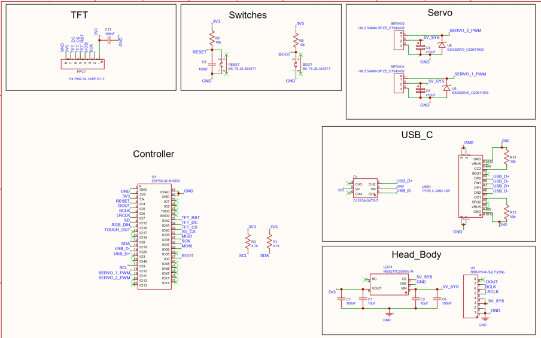
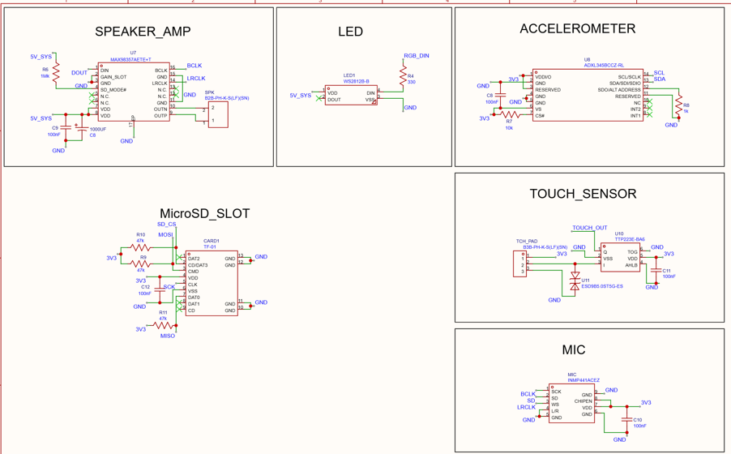
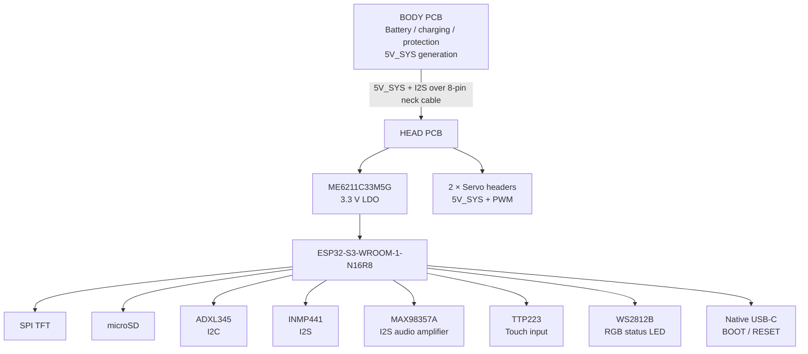

# HEAD PCB — ESP32-S3 Robot Controller

A custom **2-layer embedded controller PCB** built around the **ESP32-S3-WROOM-1-N16R8**, designed in **EasyEDA Pro** as the head/control board of a larger robot system.

## Project status

| Area | Status |
|---|---|
| Schematic | Complete |
| PCB layout | Complete |
| EasyEDA Pro source | Included |
| BOM | Included |
| DRC | Not claimed until an exported DRC report is committed |
| Gerber / NC drill | Not yet committed |
| Fabrication | Not documented |
| Assembly / bring-up | Not documented |
| Bench measurements | Not documented |
| BODY PCB | Part of the wider architecture; editable design is not included here |
| Live 3D viewer | Not currently published / verified |

See [`docs/project-status.md`](docs/project-status.md) for the same status in a dedicated page.

## Visual overview

### PCB layout


## Schematic

### Main Controller, Power and Interfaces



The main schematic shows the **ESP32-S3 controller**, **USB-C interface**, **BOOT/RESET circuitry**, **3.3 V regulation**, **TFT connector**, **dual servo interfaces**, and the **head-to-body connection**.

### Sensors, Audio and Peripherals



The peripheral schematic includes the **MAX98357A audio amplifier**, **WS2812B RGB LED**, **ADXL345 accelerometer**, **microSD interface**, **TTP223 touch sensor**, and **INMP441 digital microphone**.

### Functional block diagram



## What this board does

The HEAD PCB is the low-voltage control and interface board of a two-board robot architecture. It receives **5V_SYS**, generates **3.3 V** for the ESP32-S3 and logic, and integrates sensing, storage, audio, user-interface and servo-control hardware.

```text
Samsung 21700 battery
        |
        v
BODY PCB
(charging + protection + 5V_SYS generation)
        |
        | 8-pin neck cable
        v
HEAD PCB
        |
        +--> ME6211C33M5G --> 3.3 V --> ESP32-S3 + logic
        +--> 5V_SYS ----------------> servos + audio amplifier
        |
        +--> TFT / microSD / ADXL345 / INMP441 / TTP223 / RGB LED
```

**BODY PCB scope:** the BODY PCB is part of the overall system architecture, but its editable schematic/PCB files are **not included in this repository**. This repository is intentionally scoped to the HEAD PCB.

## Why ESP32-S3?

The ESP32-S3 was selected because it combines **Wi-Fi/BLE, native USB, SPI, I2C, I2S and PWM peripherals** in one MCU. The N16R8 module also provides additional flash/PSRAM headroom for display buffers, audio data, sensor processing and larger embedded applications.

## Key hardware

| Block | Device / Interface | Role |
|---|---|---|
| MCU | **ESP32-S3-WROOM-1-N16R8** | Main controller |
| 3.3 V regulation | **ME6211C33M5G-N** | 5V_SYS to 3.3 V logic rail |
| USB protection | **D1213A-04TS-7** | ESD protection on USB data lines |
| Display | SPI TFT | Local user interface |
| Storage | microSD, SPI | Local data / asset storage |
| Motion sensor | **ADXL345BCCZ-RL**, I2C | 3-axis acceleration sensing |
| Microphone | **INMP441ACEZ**, I2S | Digital audio input |
| Audio amplifier | **MAX98357AETE+T**, I2S | Class-D speaker drive |
| Touch | **TTP223E-BA6** | Capacitive-touch input |
| Actuation | 2 × servo headers | PWM servo control |
| RGB | **WS2812B** | Addressable status indication |
| Programming | USB + BOOT + RESET | Native USB programming/debug |

## Power architecture

- **5V_SYS:** servo motors and audio power.
- **3.3 V:** ESP32-S3 and low-voltage logic/peripherals.
- Bottom layer is used as a continuous ground reference where possible.
- Wide 5 V routing and local bulk capacitance are used near dynamic loads.

### Boot and supply-stability additions

- **100 nF capacitor from ESP32 EN to GND**.
- **10 kΩ pull-up from GPIO0/BOOT to 3.3 V**; BOOT switch pulls GPIO0 to GND.
- **100 nF LDO VIN decoupling** close to the regulator.
- **100 nF LDO VOUT decoupling** close to the regulator.

## ESP32-S3 interface map

| ESP32 GPIO | Function |
|---|---|
| GPIO36 | SPI MOSI |
| GPIO37 | SPI SCK |
| GPIO38 | SPI MISO |
| GPIO39 | microSD CS |
| GPIO33 | TFT CS |
| GPIO34 | TFT DC |
| GPIO42 | TFT RESET |
| GPIO8 | I2C SDA |
| GPIO9 | I2C SCL |
| GPIO5 | I2S BCLK |
| GPIO6 | I2S LRCLK |
| GPIO4 | I2S audio DOUT |
| GPIO7 | INMP441 microphone data |
| GPIO10 | Servo 1 PWM |
| GPIO11 | Servo 2 PWM |
| GPIO15 | RGB LED DIN through 330 Ω |
| GPIO16 | TTP223 touch output |
| GPIO19 | USB D− |
| GPIO20 | USB D+ |

## External connections

- **8-pin Body → Head connector:** 2 × GND, 2 × 5V_SYS, I2S_BCLK, I2S_LRCLK, I2S_DIN, NC.
- **2 × servo headers:** GND, 5V_SYS, PWM.
- **Speaker output:** differential SPK+ / SPK−.
- **Touch-pad connector:** GND, TOUCH_PAD, 3.3 V.
- **TFT connector/header:** SPI/control signals, 3.3 V and GND.
- **microSD:** 3.3 V SPI storage interface.
- **USB-C:** native ESP32-S3 USB programming/data with ESD protection.

## PCB/layout choices

- 2-layer FR-4, nominal 1.6 mm board thickness and 1 oz copper.
- Bottom layer used as a solid ground reference where possible.
- 45° routing preferred over 90° corners.
- High-current 5V_SYS routes kept short and wide.
- SPI/I2S/USB routes kept over a solid return path and away from servo power.
- ESP32 antenna keep-out treated as a placement constraint.
- Decoupling capacitors placed close to IC supply pins.
- ESD devices placed near exposed connectors/signals.

## Bill of Materials

A source-derived BOM is included at [`hardware/BOM_HEAD_PCB.csv`](hardware/BOM_HEAD_PCB.csv).

## Design documentation

- [`docs/architecture.md`](docs/architecture.md) — system and signal architecture
- [`docs/pin-mapping.md`](docs/pin-mapping.md) — GPIO/interface allocation
- [`docs/design-decisions.md`](docs/design-decisions.md) — design rationale
- [`docs/design-specification.md`](docs/design-specification.md) — formatted electrical specification
- [`docs/project-status.md`](docs/project-status.md) — explicit completion / validation status
- [`docs/bring-up-checklist.md`](docs/bring-up-checklist.md) — post-fabrication validation plan

## Native design source

The PCB was designed in **EasyEDA Pro**. The editable project source is included at:

[`hardware/easyeda/HEAD_PCB.epro2`](hardware/easyeda/HEAD_PCB.epro2)

Import instructions are available in [`hardware/easyeda/README.md`](hardware/easyeda/README.md).

## Manufacturing outputs

Gerber and NC drill files are **not included yet** because a verified export from the final PCB revision has not been committed. They should be exported from the final EasyEDA board and checked in a Gerber viewer before being added.

## 3D model status

A 3D CAD export exists separately, but no verified model or public live viewer is committed in this repository yet.

## Repository structure

```text
.
├── .gitignore
├── README.md
├── LICENSE
├── hardware/
│   ├── BOM_HEAD_PCB.csv
│   └── easyeda/
│       ├── HEAD_PCB.epro2
│       └── README.md
└── docs/
    ├── architecture.md
    ├── pin-mapping.md
    ├── design-decisions.md
    ├── design-specification.md
    ├── project-status.md
    ├── bring-up-checklist.md
    └── images/
```

## License

Released under the [MIT License](LICENSE).

---

**EDA:** EasyEDA Pro  
**MCU:** ESP32-S3-WROOM-1-N16R8  
**Board:** 2-layer embedded controller / HEAD PCB
